# MatsuriOps 管理者マニュアル

> システム管理者・実行委員・事務局向け

---

## 目次

1. [システム概要](#1-システム概要)
2. [ユーザー管理](#2-ユーザー管理)
3. [祭り管理](#3-祭り管理)
4. [タスク管理](#4-タスク管理)
5. [予算管理](#5-予算管理)
6. [シフト管理](#6-シフト管理)
7. [当日運営](#7-当日運営)
8. [レポート・分析](#8-レポート分析)
9. [その他の機能](#9-その他の機能)

---

## 1. システム概要

### 1.1 ユーザーロール

| ロール | 権限レベル | 主な操作 |
|--------|-----------|---------|
| システム管理者 | 最高 | 全機能 |
| 実行委員 | 高 | 祭り管理、スタッフ管理 |
| 事務局 | 高 | 祭り管理、予算管理 |
| リーダー | 中 | タスク管理、スタッフ指示 |
| スタッフ | 低 | タスク確認、報告 |
| ボランティア | 低 | タスク確認 |
| 出店者 | 限定 | 自分の出店情報 |
| 来場者 | 限定 | 情報閲覧 |

### 1.2 画面構成

メイン画面から各機能にアクセスできます：

```
祭り一覧
  └─ 祭り詳細
       ├─ タスク管理
       ├─ 予算管理
       ├─ スタッフ管理
       ├─ シフト管理
       ├─ 運営ダッシュボード
       ├─ チャット
       ├─ お知らせ
       ├─ ドキュメント
       ├─ レポート
       └─ ガントチャート
```

---

## 2. ユーザー管理

### 2.1 スタッフの追加

1. 祭り詳細画面を開く
2. 「スタッフ管理」をクリック
3. 「スタッフ追加」ボタンをクリック

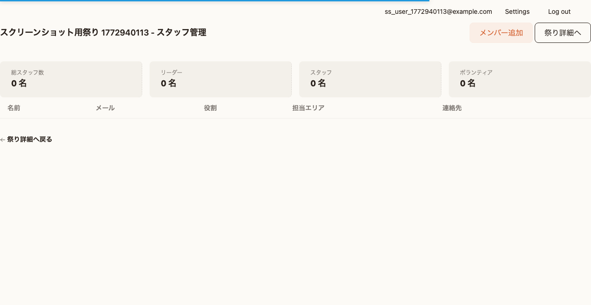

4. 以下の情報を入力：
   - メールアドレス（必須）
   - ロール（実行委員/事務局/リーダー/スタッフ/ボランティア/出店者）
   - 担当エリア
   - 備考

5. 「追加」をクリック

### 2.2 ロールの変更

1. スタッフ一覧から対象者を選択
2. 「編集」をクリック
3. ロールを変更して保存

### 2.3 スタッフの削除

1. スタッフ一覧から対象者を選択
2. 「削除」をクリック
3. 確認ダイアログで「削除」を選択

---

## 3. 祭り管理

### 3.1 祭りの作成

1. 祭り一覧画面で「新規作成」をクリック
2. 基本情報を入力：

| 項目 | 説明 | 必須 |
|------|------|------|
| 祭り名 | イベントの名称 | ✅ |
| 説明 | イベントの概要 | |
| 開始日 | 開催開始日 | ✅ |
| 終了日 | 開催終了日 | ✅ |
| 会場名 | 開催場所の名称 | |
| 会場住所 | 開催場所の住所 | |
| 規模 | 小規模/中規模/大規模 | |
| 予想来場者数 | 見込み来場者数 | |
| 予想出店数 | 見込み出店者数 | |

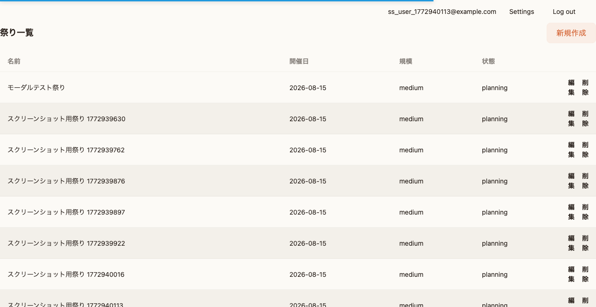

3. 「作成」をクリック

### 3.2 祭りの編集

1. 祭り詳細画面で「編集」をクリック
2. 情報を修正
3. 「保存」をクリック

### 3.3 祭りのステータス

| ステータス | 説明 |
|-----------|------|
| 企画中 | 準備開始前 |
| 準備中 | 準備作業中 |
| 開催中 | 当日運営中 |
| 完了 | 終了後 |
| 中止 | 中止された場合 |

### 3.4 テンプレートの活用

#### テンプレートから祭りを作成

1. 「テンプレート」メニューを開く
2. 使用するテンプレートを選択
3. 「このテンプレートを使用」をクリック
4. 祭り名と日程を入力
5. 「作成」をクリック

#### 祭りからテンプレートを作成

1. 祭り詳細画面を開く
2. 「テンプレートとして保存」をクリック
3. テンプレート名を入力
4. 「保存」をクリック

---

## 4. タスク管理

### 4.1 タスク一覧

祭り詳細から「タスク管理」をクリックすると、タスク一覧が表示されます。


### 4.2 タスクの作成

1. 「新規タスク」ボタンをクリック
2. タスク情報を入力：

| 項目 | 説明 |
|------|------|
| タイトル | タスク名（必須） |
| 説明 | 詳細な内容 |
| カテゴリ | タスクの分類 |
| ステータス | 未着手/進行中/完了/保留/中止 |
| 優先度 | 低/中/高/緊急 |
| 開始日 | 作業開始予定日 |
| 期限 | 完了予定日 |
| 見積時間 | 予想作業時間 |
| 進捗率 | 0-100% |
| マイルストーン | 重要タスクとしてマーク |

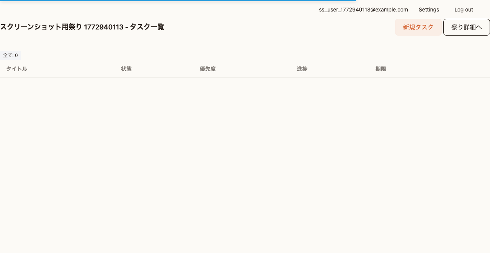

3. 「作成」をクリック

### 4.3 タスクのステータス更新

1. タスク一覧で対象タスクのステータスをクリック
2. 新しいステータスを選択
3. 自動的に保存されます

### 4.4 進捗管理

タスク詳細画面では：
- 進捗率をスライダーで更新
- チェックリスト項目の完了状態を管理
- サブタスクの確認

### 4.5 ガントチャート

1. 祭り詳細から「ガントチャート」をクリック
2. タスクの期間が視覚的に表示されます

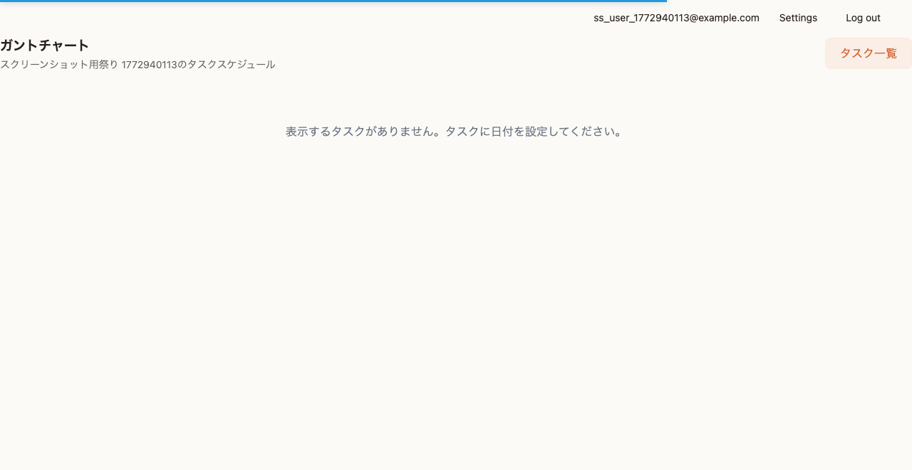

---

## 5. 予算管理

### 5.1 予算ダッシュボード

祭り詳細から「予算管理」をクリックすると、予算の概要が表示されます。

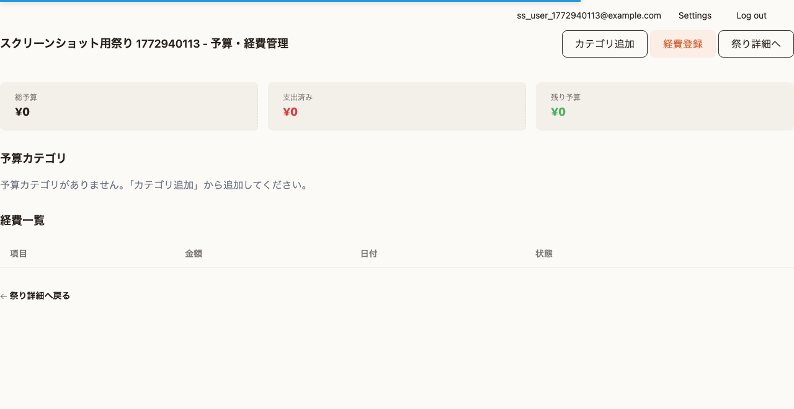

**表示される情報:**
- 総予算
- 支出合計
- 残予算
- カテゴリ別予算と執行状況

### 5.2 予算カテゴリの設定

1. 「カテゴリ追加」をクリック
2. カテゴリ情報を入力：
   - カテゴリ名（必須）
   - 説明
   - 予算額（必須）
   - 表示順

3. 「保存」をクリック

### 5.3 経費の登録

1. 「経費登録」ボタンをクリック
2. 経費情報を入力：

| 項目 | 説明 |
|------|------|
| 件名 | 経費の名称（必須） |
| 説明 | 詳細な内容 |
| カテゴリ | 予算カテゴリを選択 |
| 金額 | 支出額（必須） |
| 数量 | 購入数量 |
| 単価 | 1個あたりの価格 |
| 支出日 | 実際の支出日 |
| 支払方法 | 現金/振込/クレジット/その他 |
| 領収書番号 | 管理用番号 |
| 備考 | その他の情報 |

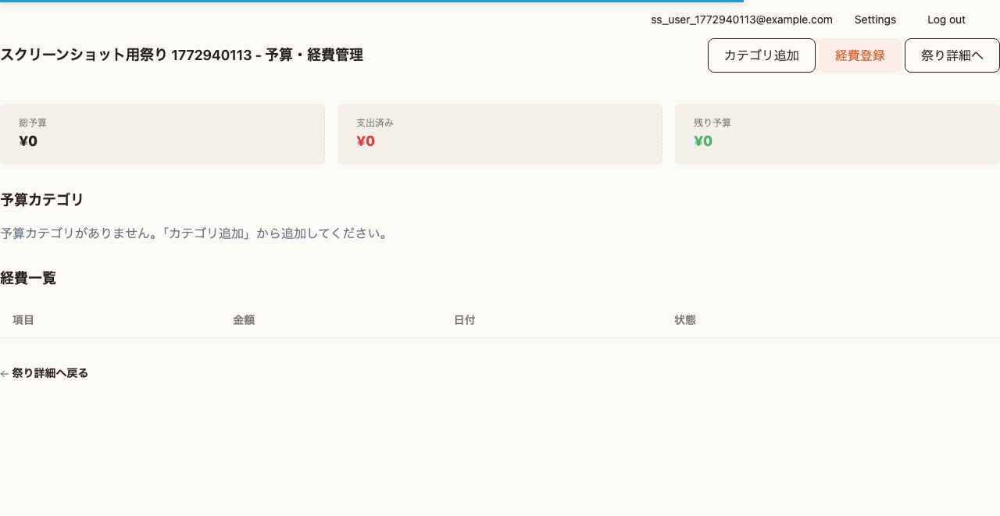

3. 「登録」をクリック

### 5.4 経費の承認

1. 経費一覧で承認待ちの経費を確認
2. 内容を確認して「承認」をクリック
3. 承認されると予算から差し引かれます

### 5.5 予算の確認

カテゴリごとに：
- 予算額
- 支出額
- 残額
- 執行率（プログレスバーで表示）

が確認できます。

---

## 6. シフト管理

### 6.1 シフト一覧

祭り詳細から「シフト管理」をクリックすると、日付別にシフトが表示されます。

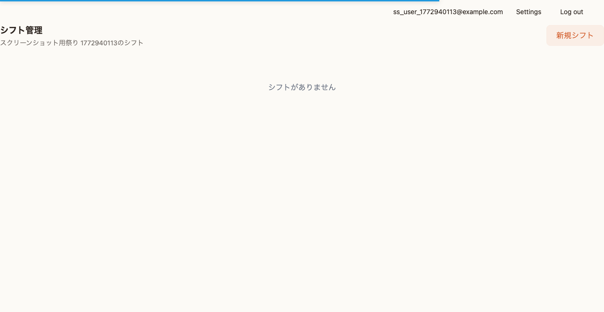

### 6.2 シフトの作成

1. 「新規シフト」ボタンをクリック
2. シフト情報を入力：

| 項目 | 説明 |
|------|------|
| シフト名 | 担当業務名 |
| 開始時刻 | シフト開始時刻 |
| 終了時刻 | シフト終了時刻 |
| 場所 | 担当場所 |
| 必要人数 | 必要なスタッフ数 |
| 説明 | 業務内容の詳細 |

3. 「作成」をクリック

### 6.3 シフトの編集・削除

- シフトカードの「編集」ボタンで編集
- 「削除」ボタンで削除

---

## 7. 当日運営

### 7.1 運営ダッシュボード

祭り詳細から「運営ダッシュボード」をクリックすると、リアルタイムの運営状況が表示されます。

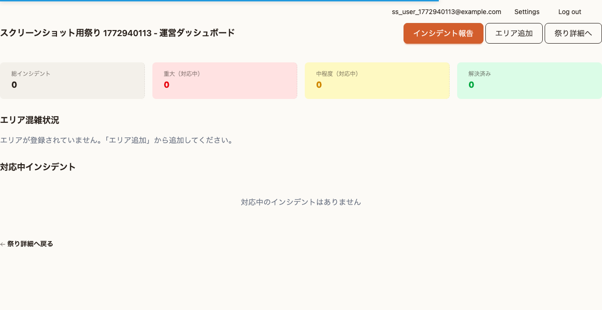

**表示される情報:**
- インシデント統計（全体/重大/中程度/解決済）
- エリア別混雑状況
- 対応中インシデント一覧

### 7.2 エリアの追加

1. 「エリア追加」ボタンをクリック
2. エリア情報を入力：
   - エリア名（必須）
   - 混雑度（0-5）
   - 気温
   - WBGT（暑さ指数）
   - 備考

3. 「保存」をクリック

### 7.3 エリア状況の更新

1. エリアカードをクリック
2. 現在の状況を更新：
   - 混雑度の変更
   - 天候情報の更新
   - 備考の追加

3. 「保存」をクリック

### 7.4 インシデント報告

1. 「インシデント報告」ボタンをクリック
2. インシデント情報を入力：

| 項目 | 説明 |
|------|------|
| タイトル | インシデントの概要（必須） |
| 説明 | 詳細な状況 |
| 重大度 | 低/中/高/緊急 |
| カテゴリ | 医療/セキュリティ/遺失物/天候/設備/その他 |
| 場所 | 発生場所 |
| ステータス | 報告済/確認中/対応中/解決/クローズ |


3. 「報告」をクリック

### 7.5 インシデント対応

1. インシデントカードをクリック
2. ステータスを更新：
   - 報告済 → 確認中 → 対応中 → 解決 → クローズ
3. 解決時は「解決内容」を記入
4. 「保存」をクリック

---

## 8. レポート・分析

### 8.1 決算報告書

1. 祭り詳細から「レポート」をクリック
2. 決算サマリーが表示されます：
   - 総予算
   - 総支出
   - 総収入
   - 収支バランス
   - カテゴリ別支出

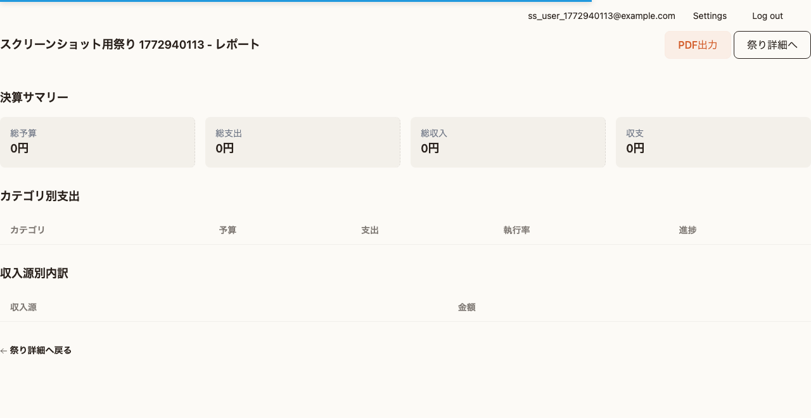

### 8.2 年度比較

1. レポート画面で「年度比較」タブをクリック
2. 比較する祭りを選択
3. 以下の比較データが表示されます：
   - 支出の増減
   - 収入の増減
   - カテゴリ別変化率

### 8.3 PDF出力

1. レポート画面で「PDF出力」ボタンをクリック
2. プレビューを確認
3. 「ダウンロード」をクリック

---

## 9. その他の機能

### 9.1 チャット

1. 祭り詳細から「チャット」をクリック
2. チャットルーム一覧が表示されます
3. ルームを選択してメッセージを送信

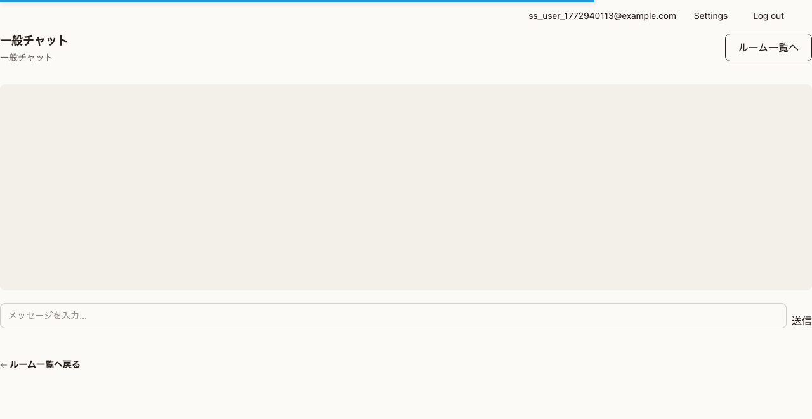

**ルームタイプ:**
- 一般: 全体連絡用
- 緊急: 緊急連絡用
- スタッフ: スタッフ間連絡
- 出店者: 出店者連絡

### 9.2 お知らせ

1. 祭り詳細から「お知らせ」をクリック
2. 「新規作成」でお知らせを作成
3. 優先度（緊急/高/通常）を設定
4. 有効期限を設定

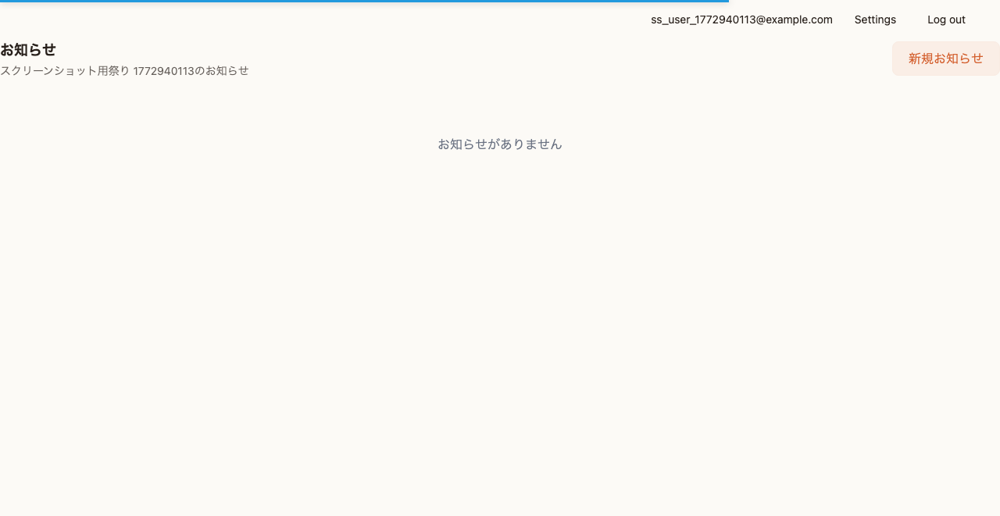

### 9.3 ドキュメント

1. 祭り詳細から「ドキュメント」をクリック
2. 「アップロード」でファイルを追加
3. カテゴリ（マニュアル/予算/計画/報告書/契約書）を設定

### 9.4 位置情報

1. 祭り詳細から「位置情報」をクリック
2. スタッフの現在位置がマップに表示されます
3. 「現在位置を共有」で自分の位置を共有

---

## トラブルシューティング

### よくある問題

| 問題 | 解決方法 |
|------|---------|
| 経費が承認できない | 承認権限を持つロールか確認 |
| タスクが表示されない | カテゴリフィルターを確認 |
| シフトが保存されない | 必須項目の入力を確認 |
| インシデントが更新されない | ページを再読み込み |

### サポート

問題が解決しない場合は、システム管理者に連絡してください。

---

*最終更新: 2026年3月*
