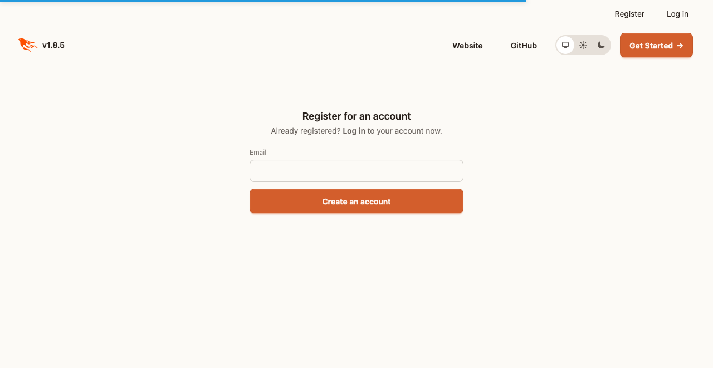
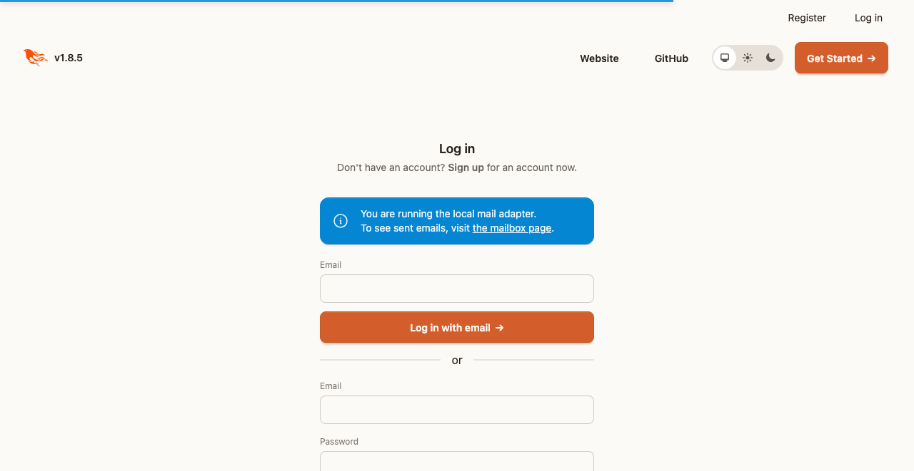
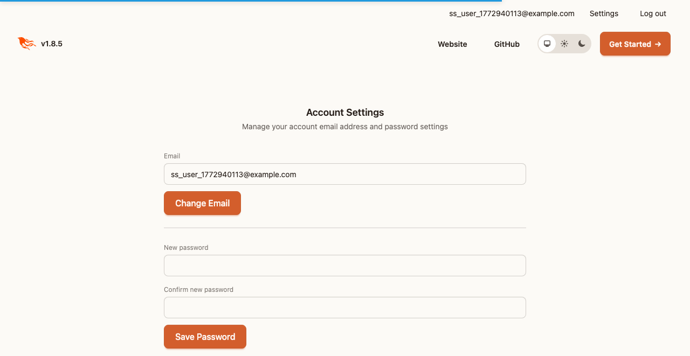
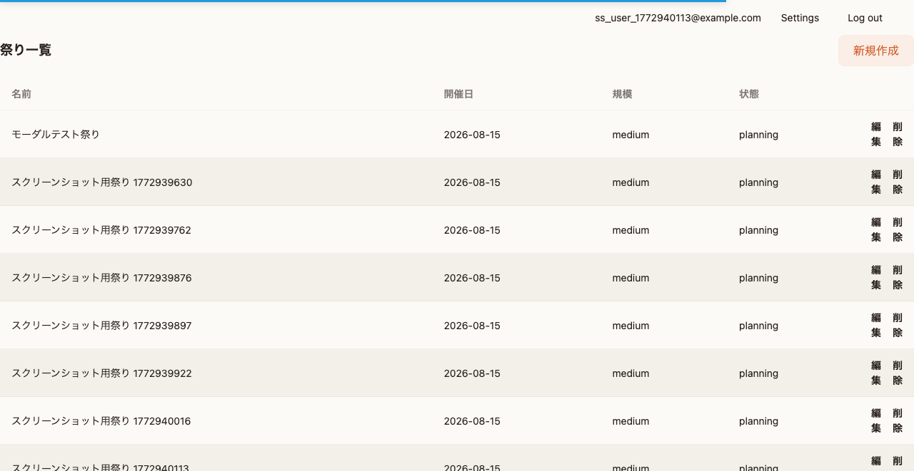
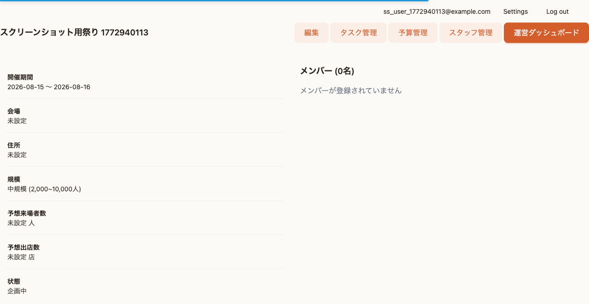

# MatsuriOps 出店者・来場者ガイド

> 外部ユーザー向けの簡易ガイド

---

## 目次

1. [アカウント登録](#1-アカウント登録)
2. [祭り情報の確認](#2-祭り情報の確認)
3. [お知らせの受信](#3-お知らせの受信)
4. [連絡先・問い合わせ](#4-連絡先問い合わせ)

---

## 1. アカウント登録

### 1.1 登録方法

1. ブラウザでMatsuriOpsにアクセス
2. 「新規登録」をクリック
3. メールアドレスを入力
4. 「登録」をクリック

### 1.2 ログイン

1. 「ログイン」をクリック
2. メールアドレスを入力
3. 届いたメールのリンクをクリック

### 1.3 プロフィール設定

ログイン後、右上のメニューから「設定」を選択：

以下の情報を入力できます：
- 名前（表示名）
- 電話番号
- 所属（店舗名など）

---

## 2. 祭り情報の確認

### 2.1 祭り一覧

ログイン後、参加している祭りの一覧が表示されます。

### 2.2 祭り詳細

祭りを選択すると、詳細情報が確認できます：

**確認できる情報:**
- 祭りの名称
- 開催日程
- 開催場所
- 規模・来場予想

---

## 3. お知らせの受信

### 3.1 お知らせの確認

祭り詳細画面から「お知らせ」をクリックします。

### 3.2 お知らせの種類

| 優先度 | 表示 | 対応 |
|--------|------|------|
| 緊急 | 🔴 赤枠 | すぐに確認してください |
| 高 | 🟠 オレンジ枠 | 早めに確認してください |
| 通常 | 通常表示 | 随時確認してください |

### 3.3 プッシュ通知の設定

重要なお知らせをリアルタイムで受け取るには：

**スマートフォンの場合:**
1. MatsuriOpsをホーム画面に追加（PWAインストール）
2. 通知の許可を求められたら「許可」を選択

**パソコンの場合:**
1. ブラウザで通知を許可
2. 通知設定をオンにする

---

## 4. 連絡先・問い合わせ

### 4.1 チャットでの連絡

祭り詳細画面から「チャット」をクリックします。

**出店者の場合:**
「出店者」ルームで運営スタッフに連絡できます。

### 4.2 お問い合わせ

以下の内容は、チャットまたは運営スタッフに直接お問い合わせください：

| 内容 | 連絡先 |
|------|--------|
| 出店に関する質問 | 出店者チャットルーム |
| 当日の緊急連絡 | 緊急チャットルーム |
| システムの問題 | 事務局 |

### 4.3 よくある質問

**Q: ログインできません**

A: メールアドレスが正しいか確認してください。メールが届かない場合は、迷惑メールフォルダを確認してください。

**Q: お知らせが見られません**

A: 祭りに参加者として登録されているか、運営スタッフに確認してください。

**Q: 通知が届きません**

A: ブラウザの通知設定を確認してください。PWAとしてインストールすると、通知を受け取りやすくなります。

---

## 出店者向け情報

### 出店準備

1. 祭り詳細画面で出店に関するお知らせを確認
2. 必要なドキュメントを「ドキュメント」から取得
3. 不明点はチャットで質問

### 当日の流れ

1. 指定の時間に会場に到着
2. 受付で出店者登録
3. 指定のエリアで設営
4. お知らせで最新情報を確認

### 緊急時の対応

問題が発生した場合：
1. 近くのスタッフに声をかける
2. 緊急チャットルームに報告
3. 指示に従って行動

---

## スマートフォンでの利用

### PWAインストール方法

MatsuriOpsはPWA（Progressive Web App）に対応しています。
ホーム画面に追加すると、アプリのように使えます。

**iPhoneの場合:**
1. Safariでアクセス
2. 画面下の「共有」ボタン（□↑）をタップ
3. 「ホーム画面に追加」を選択
4. 「追加」をタップ

**Androidの場合:**
1. Chromeでアクセス
2. 画面右上のメニュー（⋮）をタップ
3. 「ホーム画面に追加」を選択
4. 「追加」をタップ

### PWAの利点

- アプリのようにすぐにアクセス
- プッシュ通知を受け取れる
- オフラインでも一部の機能が使える

---

*最終更新: 2026年3月*
